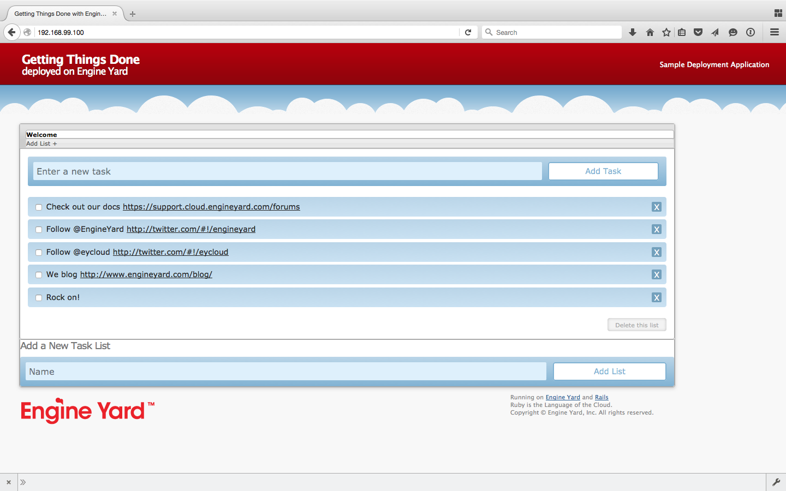

build-lists: true
# Docker and Kubernetes Training

---

# What is a container?

- Lightweight VM
- Process

---

## docker run -p 80:3000 crigor/todo

^ rails app
Uses sqlite
Like a VM because you can have your own distro
Technically a process. ps shows the rails server
We'll show you how to build the image later

---



---

```
# head -n1 /etc/os-release 
PRETTY_NAME="Debian GNU/Linux 8 (jessie)"
```

---

```
$ ps -ef | grep rails
root     24968  2629  2 06:30 ?        00:00:04 /usr/local/bin/ruby bin/rails server -b 0.0.0.0
```

---

Dockerfile

```
FROM debian:jessie
RUN apt-get update && apt-get install -y --no-install-recommends \
		ca-certificates \
		curl \
		wget
RUN apt-get update && apt-get install -y --no-install-recommends \
		bzr \
		git \
		mercurial \
		openssh-client \
		subversion \
		\
		procps
RUN apt-get update && apt-get install -y --no-install-recommends \
		autoconf \
		automake \
		bzip2 \
		file \
		g++ \
		gcc \
		imagemagick \
		libbz2-dev \
		libc6-dev \
		libcurl4-openssl-dev \
		libevent-dev \
		libffi-dev \
		libgeoip-dev \
		libglib2.0-dev \
		libjpeg-dev \
		liblzma-dev \
		libmagickcore-dev \
		libmagickwand-dev \
		libmysqlclient-dev \
		libncurses-dev \
		libpng-dev \
		libpq-dev \
		libreadline-dev \
		libsqlite3-dev \
		libssl-dev \
		libtool \
		libwebp-dev \
		libxml2-dev \
		libxslt-dev \
		libyaml-dev \
		make \
		patch \
		xz-utils \
		zlib1g-dev \
```

---

Dockerfile cont.

```
# skip installing gem documentation
RUN mkdir -p /usr/local/etc \
	&& { \
		echo 'install: --no-document'; \
		echo 'update: --no-document'; \
	} >> /usr/local/etc/gemrc

ENV RUBY_MAJOR 2.2
ENV RUBY_VERSION 2.2.4
ENV RUBY_DOWNLOAD_SHA256 b6eff568b48e0fda76e5a36333175df049b204e91217aa32a65153cc0cdcb761
ENV RUBYGEMS_VERSION 2.5.2

# some of ruby's build scripts are written in ruby
# we purge this later to make sure our final image uses what we just built
RUN set -ex \
	&& buildDeps=' \
		bison \
		libgdbm-dev \
		ruby \
	' \
	&& apt-get update \
	&& apt-get install -y --no-install-recommends $buildDeps \
	&& rm -rf /var/lib/apt/lists/* \
	&& curl -fSL -o ruby.tar.gz "http://cache.ruby-lang.org/pub/ruby/$RUBY_MAJOR/ruby-$RUBY_VERSION.tar.gz" \
	&& echo "$RUBY_DOWNLOAD_SHA256 *ruby.tar.gz" | sha256sum -c - \
	&& mkdir -p /usr/src/ruby \
	&& tar -xzf ruby.tar.gz -C /usr/src/ruby --strip-components=1 \
	&& rm ruby.tar.gz \
	&& cd /usr/src/ruby \
	&& { echo '#define ENABLE_PATH_CHECK 0'; echo; cat file.c; } > file.c.new && mv file.c.new file.c \
	&& autoconf \
	&& ./configure --disable-install-doc \
	&& make -j"$(nproc)" \
	&& make install \
	&& apt-get purge -y --auto-remove $buildDeps \
	&& gem update --system $RUBYGEMS_VERSION \
	&& rm -r /usr/src/ruby

ENV BUNDLER_VERSION 1.11.2

RUN gem install bundler --version "$BUNDLER_VERSION"

# install things globally, for great justice
# and don't create ".bundle" in all our apps
ENV GEM_HOME /usr/local/bundle
ENV BUNDLE_PATH="$GEM_HOME" \
	BUNDLE_BIN="$GEM_HOME/bin" \
	BUNDLE_SILENCE_ROOT_WARNING=1 \
	BUNDLE_APP_CONFIG="$GEM_HOME"
ENV PATH $BUNDLE_BIN:$PATH
RUN mkdir -p "$GEM_HOME" "$BUNDLE_BIN" \
	&& chmod 777 "$GEM_HOME" "$BUNDLE_BIN"
```

---

Dockerfile cont.

```
# throw errors if Gemfile has been modified since Gemfile.lock
RUN bundle config --global frozen 1

RUN mkdir -p /usr/src/app
WORKDIR /usr/src/app

COPY Gemfile /usr/src/app/
COPY Gemfile.lock /usr/src/app/
RUN bundle install

COPY . /usr/src/app

RUN apt-get update && apt-get install -y nodejs --no-install-recommends && rm -rf /var/lib/apt/lists/*
RUN apt-get update && apt-get install -y mysql-client postgresql-client sqlite3 --no-install-recommends && rm -rf /var/lib/apt/lists/*

EXPOSE 3000
CMD ["rails", "server", "-b", "0.0.0.0"]
```

---

FROM debian:jessie

---

RUN apt-get update 
RUN apt-get install git

---

RUN curl -fSL -o ruby.tar.gz \
    "http://cache.ruby-lang.org/pub/ruby/$RUBY\_MAJOR/ruby-$RUBY\_VERSION.tar.gz"

---

RUN mkdir -p /usr/src/app
COPY . /usr/src/app

---

RUN bundle install

---

CMD ["rails", "server", "-b", "0.0.0.0"]

---

## docker build -t crigor/todo .

^ Then push the repo to Docker Hub or quay

---

## docker push crigor/todo

^ goes to Docker Hub

---

## docker push quay.io/crigor/todo

^ docker tag crigor/todo quay.io/crigor/todo

---

## docker run -p 80:3000 crigor/todo

^ Recap

---

# Loadbalancing

Preparation of Multiple app "upstreams"

```
docker run -d --name=app1 crigor/todo
docker run -d --name=app2 crigor/todo
```

Note the IP addresses:

```
docker inspect --format '{{ .NetworkSettings.IPAddress }}' app1
172.17.0.2
docker inspect --format '{{ .NetworkSettings.IPAddress }}' app2
172.17.0.3
```

Prepare the loadbalancer `nginx.conf`:

```
events { }

http {
  upstream app_server {
    server 172.17.0.2:3000;
    server 172.17.0.3:3000;
  }
  server {
    location / {
      proxy_pass http://app_server;
    }
  }
}
```

Run the nginx container:

```
docker volume create nginx
docker create --name=nginx --volumes-from nginx:/etc/nginx --net=host nginx
docker cp nginx.conf nginx:/etc/nginx/nginx.conf
docker start nginx
```

Scale-out! Add an instance

```
docker run -d --name=app3 crigor/todo
docker inspect --format '{{ .NetworkSettings.IPAddress }}' app3
172.17.0.3
```

Update the upstreams in config. Reload nginx

```
vi nginx.conf
docker cp nginx.conf nginx:/etc/nginx/nginx.conf
docker kill -s HUP nginx
```

---

Install Docker Toolbox
Run containers
Build your own docker images
Push to Docker Hub or Quay

^ Hands-on part

---

# Kubernetes

^ Higher level than docker

^ Multiple machines

---
